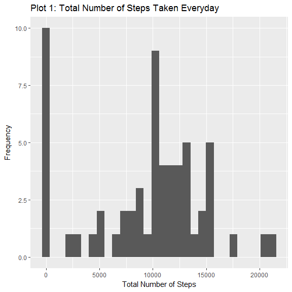
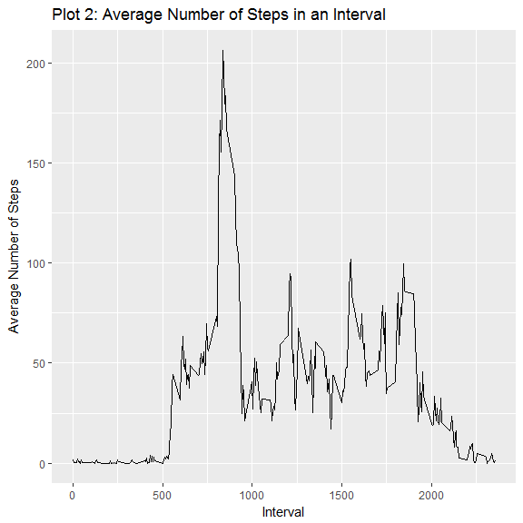
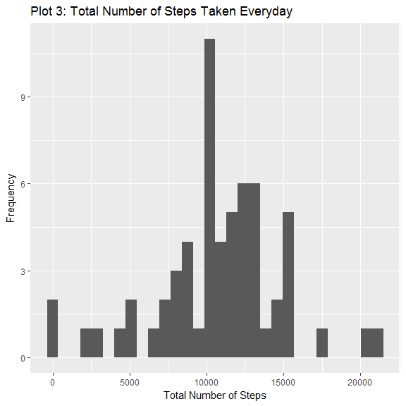
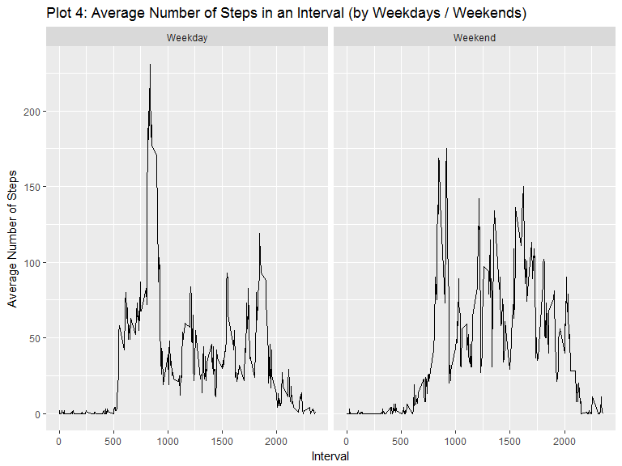

# Reproducible Research Assignment 1
Shubham Shishodia  
April 30, 2017  

### Introduction

This document covers a step by step approach to answer all the questions asked in the first peer graded assignment in the Reproducible Research course on Coursera. The data has been obtained from the assignment page. The document has the following sections:

*1.* *Global Settings*  
*2.* *Reading and Preprocessing the data*  
*3.* *Total Number of Steps Taken Everyday*  
*4.* *Average Daily Pattern of Steps*  
*5.* *Imputing Missing Values*  
*6.* *Activity Patterns for Weekdays and Weekends*  

Please note that all observations and plots pertaining to a  particular section are reported at the end of the corresponding code chunk.

### Global Settings


```r
## Loading required packages

library(dplyr)
library(ggplot2)
library(lubridate)
library(knitr)

## Global Options
options(scipen = 999)
opts_chunk$set(fig.height = 6, fig.width = 6, echo=TRUE, message = FALSE)
```

### Reading and preprocessing the data

The data has been read assuming that the zipped file downloaded from the assignment website is in the working directory, and has not been renamed.The data has been stored in the dataset **activity**.


```r
## Loading the data

activity<-read.csv(unzip("repdata%2Fdata%2Factivity.zip"),stringsAsFactors = FALSE,na.strings = "NA")
str(activity)
```

```
## 'data.frame':	17568 obs. of  3 variables:
##  $ steps   : int  NA NA NA NA NA NA NA NA NA NA ...
##  $ date    : chr  "2012-10-01" "2012-10-01" "2012-10-01" "2012-10-01" ...
##  $ interval: int  0 5 10 15 20 25 30 35 40 45 ...
```

```r
activity$date<-as.Date(activity$date,"%Y-%m-%d")
str(activity)
```

```
## 'data.frame':	17568 obs. of  3 variables:
##  $ steps   : int  NA NA NA NA NA NA NA NA NA NA ...
##  $ date    : Date, format: "2012-10-01" "2012-10-01" ...
##  $ interval: int  0 5 10 15 20 25 30 35 40 45 ...
```

We see that the "date" column is initially read as type "character". Thus, I have converted the class of the column to  "date" to make further calculations easier.  

### Total Number of Steps Taken Everyday

For this section, I have created a new dataset, **steps**, which has date from the **activity** dataset and total number of steps taken for the corresponding date. A histogram showing the total number of steps corresponding to each day has been plotted using **steps**, and the ggplot plotting system.


```r
steps<-data.frame(date=unique(activity$date),total = tapply(activity$steps,activity$date,sum, na.rm=TRUE))

meansteps<-round(mean(steps$total,na.rm = TRUE)) ## Calculate mean number of steps taken everyday
mediansteps<-median(steps$total,na.rm = TRUE)    ## Calculate median number of steps taken everyday

## Plot data

h<-ggplot(steps,aes(total))
h+geom_histogram()+
labs(x="Total Number of Steps",y= "Frequency")+ggtitle("Plot 1: Total Number of Steps Taken Everyday")
```

<!-- -->

The average number of total steps taken each day are **9354** and the median number of total steps are **10395**.

### Average Daily Pattern

As done in the previous section, here also I have created a dataframe **timeseries** to capture the average number of steps across all days for each interval. The dataframe has been used to plot the required timeseries.


```r
timeseries<-data.frame(interval=unique(activity$interval),
                       meansteps = tapply(activity$steps,activity$interval, mean, na.rm = TRUE))

maxinterval<-arrange(timeseries,desc(meansteps))[1,1] ## Calculate interval with maximum average steps

## Plot data 

t<-ggplot(timeseries,aes(interval,meansteps))
t+geom_line()+labs(x="Interval",y="Average Number of Steps")+ggtitle("Plot 2: Average Number of Steps in an Interval")
```

<!-- -->

The interval with maximum daily average steps is **835**.  

### Imputing Missing Values

For this part, the missing values were replaced by the mean value of number of steps for a particular interval for a particular day. For example, if a value is missing for interval "5" on a Monday, the mean of steps for interval 5 on a Monday has been used to replace the missing value.

For this, I created a temporary dataframe **temp**. Apart from the data from **activity** dataset, I added two more columns to **temp**. The column *day* contains the day corresponding to a particular date (Mon, Tues, etc.). The other column, *id*, creates an identifier by pasting values of the columns *day* and *interval*. 

Next, I created another dataframe,**values**, containing mean values of steps corresponding to a particular day and interval. This was done using the *aggregate* function. I created a similar *id* column for **values** to impute the missing values of **temp** accordingly.

Once the missing values were imputed, I subsetted **temp** and assigned it to a new dataset called **newact**. I retained the *day* column from **temp** in **newact** as it would be required in the next section.

The plot was constructed using the same approach followed in section 1 with **newact** dataset.


```r
missing<-sum(is.na.data.frame(activity))               ## Calculate number of rows with missing values

temp<-activity                                         ## Copy activity into temp
temp$day<-sapply(temp$date,wday,label=TRUE,abbr=TRUE)  ## Add the column 'day' to temp
temp$id<-paste(temp$day,temp$interval,sep = ".")       ## Add the column 'id' to temp
str(temp)
```

```
## 'data.frame':	17568 obs. of  5 variables:
##  $ steps   : int  NA NA NA NA NA NA NA NA NA NA ...
##  $ date    : Date, format: "2012-10-01" "2012-10-01" ...
##  $ interval: int  0 5 10 15 20 25 30 35 40 45 ...
##  $ day     : Factor w/ 7 levels "Sun","Mon","Tues",..: 2 2 2 2 2 2 2 2 2 2 ...
##  $ id      : chr  "Mon.0" "Mon.5" "Mon.10" "Mon.15" ...
```

```r
values<-aggregate(temp$steps,list(day=temp$day,interval=temp$interval),mean,na.rm=TRUE) ## Construct values dataframe
values$id<-paste(values$day,values$interval,sep = ".") ## Add the column 'id' to values
values$x<-as.integer(round(values$x))
str(values)
```

```
## 'data.frame':	2016 obs. of  4 variables:
##  $ day     : Factor w/ 7 levels "Sun","Mon","Tues",..: 1 2 3 4 5 6 7 1 2 3 ...
##  $ interval: int  0 0 0 0 0 0 0 5 5 5 ...
##  $ x       : int  0 1 0 4 6 0 0 0 0 0 ...
##  $ id      : chr  "Sun.0" "Mon.0" "Tues.0" "Wed.0" ...
```

```r
temp$steps[is.na(temp$steps)]<-values$x[match(temp$id,values$id)] ## Replace missing values with calculated mean
```

```
## Warning in temp$steps[is.na(temp$steps)] <- values$x[match(temp$id, values
## $id)]: number of items to replace is not a multiple of replacement length
```

```r
newact<-temp[,c(1:4)]
str(newact)
```

```
## 'data.frame':	17568 obs. of  4 variables:
##  $ steps   : int  1 0 0 0 0 5 0 0 0 0 ...
##  $ date    : Date, format: "2012-10-01" "2012-10-01" ...
##  $ interval: int  0 5 10 15 20 25 30 35 40 45 ...
##  $ day     : Factor w/ 7 levels "Sun","Mon","Tues",..: 2 2 2 2 2 2 2 2 2 2 ...
```

```r
steps1<-data.frame(date=unique(newact$date),total = tapply(newact$steps,newact$date,sum))

meansteps1<-round(mean(steps1$total,na.rm = TRUE)) ## Calculate mean for imputed data
mediansteps1<-median(steps1$total,na.rm = TRUE)    ## Calculate median  for imputed data

## Plot data

h1<-ggplot(steps1,aes(total))
h1+geom_histogram()+
labs(x="Total Number of Steps", y="Frequency")+ggtitle("Plot 3: Total Number of Steps Taken Everyday")
```

<!-- -->

The number of rows with missing values are **2304**. The average number of total steps taken each day for imputed data are **10765** and the median number of total steps are **10765**. There is a difference of **13.11%** in mean and a difference  of **3.44%** in median. For this particular case, we observe that the mean is more sensitive to imputation of missing values than the median.

## Activity Patterns Between Weekdays and Weekends

Continuing with the **newact** dataset, I created a new column *wday* which contains two factor levels indicating whether the corresponding date is a weekday or a weekend. Weekends are considered as Saturday and Sunday. I then created a dataframe **timeseries1** which contains the average number of steps for a given interval for weekdays and weekends. A line plot was then plotted using **timeseries1**.


```r
newact$wday<-as.factor(ifelse(newact$day=="Sun"|newact$day=="Sat","Weekend","Weekday"))## Add columnn 'wday' to newact
str(newact)
```

```
## 'data.frame':	17568 obs. of  5 variables:
##  $ steps   : int  1 0 0 0 0 5 0 0 0 0 ...
##  $ date    : Date, format: "2012-10-01" "2012-10-01" ...
##  $ interval: int  0 5 10 15 20 25 30 35 40 45 ...
##  $ day     : Factor w/ 7 levels "Sun","Mon","Tues",..: 2 2 2 2 2 2 2 2 2 2 ...
##  $ wday    : Factor w/ 2 levels "Weekday","Weekend": 1 1 1 1 1 1 1 1 1 1 ...
```

```r
timeseries1<-aggregate(newact$steps,list(interval=newact$interval,wday=newact$wday),mean)
timeseries1$x<-as.integer(round(timeseries1$x))
str(timeseries1)
```

```
## 'data.frame':	576 obs. of  3 variables:
##  $ interval: int  0 5 10 15 20 25 30 35 40 45 ...
##  $ wday    : Factor w/ 2 levels "Weekday","Weekend": 1 1 1 1 1 1 1 1 1 1 ...
##  $ x       : int  2 0 0 0 0 2 1 1 0 2 ...
```

```r
## Plot data

t<-ggplot(timeseries1,aes(interval,x))
t+geom_line()+facet_grid(.~wday)+labs(x="Interval", y="Average Number of Steps")+
  ggtitle("Plot 4: Average Number of Steps in an Interval (by Weekdays / Weekends)")
```

<!-- -->

From the plots, we can see that the maximum average number of steps are lower for weekends compared to weekdays. However, the intervals where the maximum value occurs are about the same. Also, we notice that the average steps for weekends are more evenly distributed, with frequent peaks of comparable height, than weekdays. 
